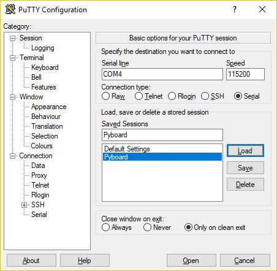

Overview
--------
This repos is my code for a 4 legged walking "mech" named Numa2.

Numa 2 is built to compete in the Mech Warefare competitions, which originated
at RoboGames circa 2009.

Code is micropython, which is essentially python3. However, a key source of
code smells is that this code originally was my C++ code for my original Numa,
and I decided to convert that code to micropython. When inspired, I refactor
to improve this...

Thanks the the python3 simularity, I wrote my micropython such that key minimal
portions of hardware interaction code could be easily mocked, letting me run e.g.
the inverse kinematics code on a full computer, with outputs being plotted
in a Jupyter notebook.

Credits:
--------

Math functions for vectors adapted from WebbotLib 2.0 source code.

Bioloid micropython library by DHylands with general micropython implmentations for microcontrollers.

uCee project by JHylands building on the bioloid library and providing AX-12 specific functionality.

Python 3.x library `mnfy` mnfy.py script from which I base minification of all modules to be uploaded.
https://github.com/brettcannon/mnfy

IK code is my own, ported from C for first version of Numa.

Dependencies:
-------------
Written for micropython, which is based on python 3.4 feature set.

For minifying the code, uses `pyminify` (install with pip3).

Previously we used `mnfy` (install with pip3), but this only supports up to
python3.4. While fine for micropython, it's not runnable on a computer that
typically has a newer python.

Testing:
--------
Step 1 is always `pyflakes`.

*Testing the IK:* A few jupyter notebooks in `numac_porting/` are set up to
allow tweaking the leg lengths and plotting the leg geometry as it moves through e.g.
the walking gait.

*Testing without servos:* A few key spots in the code have import checks to identify if
code is running via python3 or micropython.  In the python3 case, some simple mocks
are used to ignore some components.

*Testing iteration speed of gait code:* As a crude early pass, `testing/test_iteration_speed.py`
was written to test how fast the gait code could do iterations on the pyboard.
The rough findings were 

Uploading:
----------
Steps:

1. Save everything in `numac_porting`
2. Run the `create_upload_files.py` to copy just the files needed on robot, and to reduce their size:
   ~~`python3 create_upload_files.py`~~
3. Using Windows Explorer (? or better?) copy the created files in micropy-to-upload
4. ???

Possible enhancement:
- Script-based upload
- Generate new files in a new_uploads folder; compare them with the micropy-to-upload folder,
  delete new_uploads files that are identical; copy non-identical files to micropy-to-upload
  - Allows copying fewer files easily

Interacting and testing with Pyboard
-----------
I find just using python print statements works pretty well for troubleshooting.
To give myself an interactive session with the Pyboard, I use a saved PuTTY configuration
like this:

Particularly useful is that `ctrl + d` will actually do a software reset of the Pyboard,
easily letting me test the code from its start.
